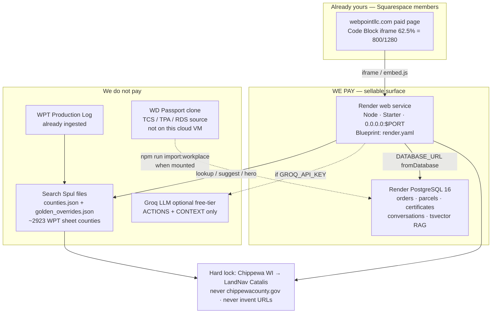

# WebPoint Tax Certificate Processor — architecture

End-user + operator map of what is actually running. **We pay for Render web + Render PostgreSQL.** Everything else is in-repo, already owned, or free-tier optional.

Live visual (1280×800 scale-to-fit, WebPoint dark navy / cyan glow, full borders, no left accent stripes): [`public/architecture.html`](../public/architecture.html). Squarespace paste: [`public/SQUARESPACE_ARCHITECTURE_EMBED.html`](../public/SQUARESPACE_ARCHITECTURE_EMBED.html).

## Paid vs not paid

| Piece | Cost | Role |
| --- | --- | --- |
| Render web service (Node, Starter, Oregon, `0.0.0.0:$PORT`) | **Paid** | Sellable Squarespace iframe surface |
| Render PostgreSQL 16 (`tsvector` RAG, orders/parcels/certificates) | **Paid** | Durable store — Render disk is ephemeral |
| Search Spul county DB (`data/counties.json`) | $0, in-repo | Locked collector URLs |
| Golden URL locks (`data/golden_overrides.json`) | $0, in-repo | Chippewa WI → LandNav |
| WPT Production Log (~2,923 jurisdictions) | $0, already ingested | Sheet counties; missing URLs stay `needs_correction` |
| Groq Llama 3.3 70B | $0 if keyed on free tier | Chat context only — never invents URLs |
| Squarespace members page | Already Bill’s | Hosts the iframe |
| WD Passport clone (TCS/TPA/RDS source) | Hardware Bill owns | Not mounted on the cloud VM |
| Render MCP OAuth | Cannot complete in cloud agent | Apply Blueprint `render.yaml` in the dashboard |

Do **not** add Pinecone, Algolia, Elastic Cloud, OpenAI embeddings, or other paid search vendors.

## How a search travels

## Runtime rules

- Chippewa County, Wisconsin is the first live county. Tax search URL is the LandNav / Catalis public portal. Guest Sign In. Batch cap = 10 parcels.
- Hero search → `/api/suggest` (typeahead from the county catalog) → `/api/lookup` (instant SPUL card). Chat → `/api/chat` (RAG + optional Groq). The UI only opens `officialUrl` / locked URLs — never a Google fallback.
- Cloud agents cannot see USB. `cursor-cloud list-self-hosted-workers` was empty. Finder hiding a blinking-green WD is usually: volume not mounted, NTFS without macFUSE/Mounty, or Privacy → External Volumes not allowed. Steps are on `architecture.html`.

## Deploy

Apply `render.yaml` in the Render dashboard (Blueprint). Set `GROQ_API_KEY` and optional `MEMBER_EMBED_KEY` there — never in git.
